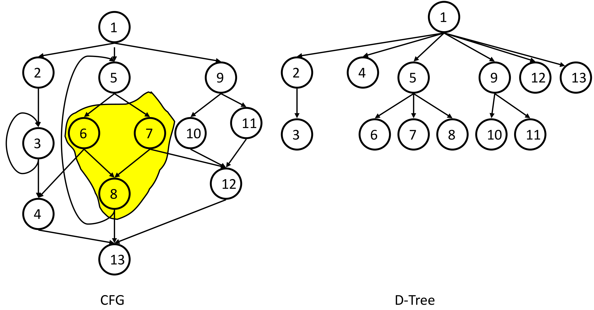
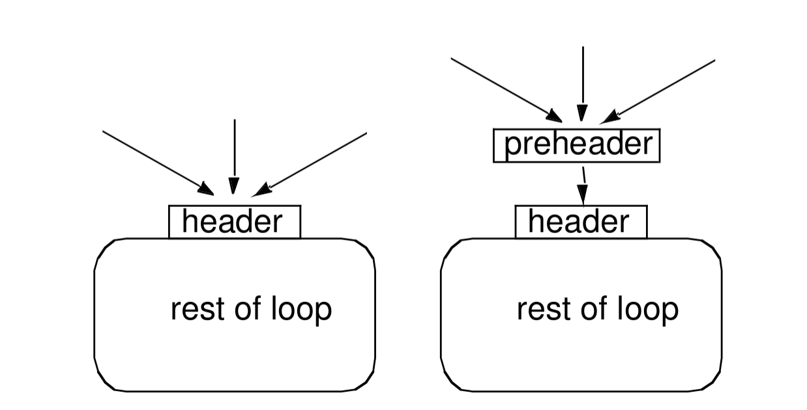
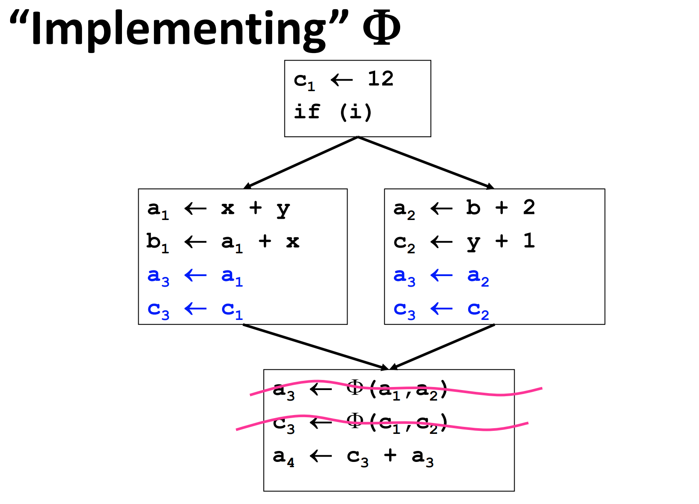

## Loops

### Definitions

#### Dominator

Node d {==dominates==} node n in agraph (d dom n) if every path from the start node to n goes through d. Dominators can be organized as a tree.

 

#### Natural loops

A header dominates all nodes in the loop, and a back edge is an arc whose head dominates its tail. (tail -> head) The natural loop of a back edge is the smallest set of nodes that includes the head and tail of the back edge, and has no predecessors outside the set, except for the predecessors of the header. 

### Algorithm to find Natural Loops 

#### Finding Dominators

Use dataflow analysis framework to find Dominators.

|||
|-|-|
|Direction|forward|
|Values|Basic blocks|
|Meet operator|$\cap$|
|Top|all BBs|
|Bottom|Empty set|
|Boundary condition| $OUT(E) = E$|
|Initialization for internal nodes|$OUT(BB) = T$|
|Transfer function|$f(b) = {b} \cup (\cap_{p = pre(b)}OUT[p])$|

#### Finding Back Edges
Traverse edges in a depth-first search of the flow graph form a depth-first spanning tree. Then we categorize edges in graph into :

    - Advancing (A) edges: from ancestor to proper descendant

    - Cross (C) edges: from right to left
    
    - Retreating (R) edges: from descendant to ancestor (not necessarily proper)

Then for each retreating edge t->h, we will check if h is in t's dominator list. 

#### Constructing Natural Loops

The natural loop of a back edge is the smallest set of nodes that includes the head and tail of the back edge, and has no predecessors outside the set, except for the predecessors of the header.

##### Algorithm

- delete h from the flow graph
- find those nodes that can reach t

### Preheader
Optimizations often require code to be executed
once before the loop. So Create a preheader basic block for every loop.

 

From an optimization perspective, not every cycle is a loop. 

## Static Single Assignment (SSA)

### What is SSA?

{==Static single assignment==} is an IR where every variable is assigned a value at most once in the program text.

$\Phi$ merges multiple definitions along multiple control paths into a single definition.

#### How do we choose which $x_i$ to use?

In fact, we don't really care, because we just need to use `mov` on each incoming edge.

 

### Why SSA?

SSA form makes use-def chains explicit in the IR, which in turn helps to simplify some optimizations.

### How to convert to SSA?

In fact, we can directly insert $\Phi$ functions for all live variables at each join point, but this is too costly, because there may be too many useless $\Phi$ functions inserted. See example below, $x_2 = \Phi(x_1,x_1)$ is totally useless and should be deleted.

 

So how to get the minimal SSA?

=== "Algorithm"

    1. Place all $\Phi$.
    2. Rename all variables.

#### When Do We Insert $\Phi$?

## 1. Introduction  

### 1.1 What do compilers do?

Compilers do two things: the first is just to translate one language to another that hardware can actually execute. The second is to improve the code.

#### 1.1.1 why we need to learn compiler optimizations?

=== "reasons"

    1. I's important to consider when {==designing hardware==} what compiler can do well and what compiler cannot do well.
    2. For people who interested in {==programming languages==}, it is also important to know what can be optimized successfully anb less successfully when you are deciding what to put into a new language. This has become a very hot topic these days when we have a lot of new languages designed for specific programming environment such as AI application, data-intensive computing. 
    3. There are a lot of {==innovation in hardware==} in terms of delivering potential performance like GPU, accelerators, etc. We need to make compilers take advantage of those things.

### 1.2 How can the compiler Improve performance? 
=== ""

    1. Minimize the number of operations.
    2. Replace expensive operations with simpler ones. For example, multiplication operations are fundamentally slower than shift operations. 
    3. Minimize cache misses. When speaking of expensive operations, one common thing is accessing memory, in morden archtecture, we have a cache hierarchy for optimization. But cache miss can be very costly. So doing things to make cache mpre effective is also very im portant.
    4. Perform work in parallel. Another thing we can do is to harness all of the parallel hardware such as GPUs which  have thousands of parallel processing elements in them. Here we want to both be doing the work with a thread efficiently (instruction scheduling) and we want to generate work that can take multiple threads. 

### 1.3 Structure of a Compiler

In fact, you can just hardwire for the particular type of source code and that particular target just like you do in compiler intro class. But it's a real lack of portability. 

 

### 1.4 Ingredients in a compiler optimization 