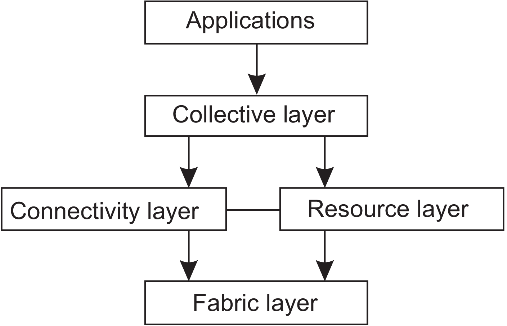
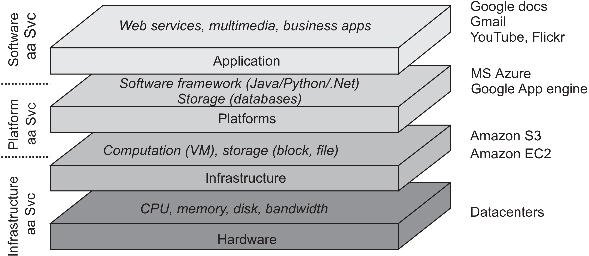

We make a distinction between distributed computing systems, distributed information systems, and pervasive systems. 

???+note "cluster computing vs. grid computing vs. cloud computing "
    In cluster computing, the underlying hardware consists of a collection of similar workstations or PCs connected by LAN. But in grid computing, the subgroup consists of distributed systems that are different when it comes to hardware, software, and deployed network technology. As for cloud computing, it provides the facilities to dynamically construct an infrastructure and compose what is needed from avaliable services.

### Cluster computing

Here we give two examples about cluster computing:

???+info "Beowulf clusters"
    Apart from the master node, the compute nodes are seen to be highly identical. The master handles the allocation of nodes and manages the jobs and provides an interface for the users of the systems.
    

???+info "MOSIX system"
    MOSIX attemps to provide a single-system image by allowing processes to dynamically and preemptively migrate between the nodes that make up the cluster.
    
However, several morden cluster computers have moved to more hybrid solutions where middleware is functionally patitioned across different nodes, becuase compute nodes with dedicated middleware will most likely provide optimal performance.

### Grid computing

???+info "Architecture"
    A traditional architecture is shown below. This architecture consists of 4 layers. 

    The **fabric layer** provides tailored interfaces to allow sharing resources within a virtual organization. 

    The **connectivity layer** consists of communication protocols for supportinggrid transactions. 
    
    The **resource layer** is responsible for managing a single resource. 

    The **collective layer** deals with handling access to multiple resources. 
    
    The **application layer** consists of the applications that operate within a virtual organization

    
    

<!--  -->

### Cloud computing
Utility computing, which means a customer could upload tasks to a data center and be charged on a per-resource basis formed the basis for what is now called cloud computing. 

???+info "Architecture"
    In practice, clouds are organized into four layers.

    The Infrastructure deployes virtualization techniques to provide customers an infrastructure consisting of virtual storage and computing resources. 

    The platform layer provides to a cloud-computing customer what an operating system provides to application developers, namely the means to easily develop and deploy applications that need to run in a cloud, somewhat like `exec` command in Unix. 

    

Cloud-computing providers offer these layers to their customers through various interface , leading to three different types to service.

???+info "different types of services"
    Infrastructure-as-a-Service (IaaS) covering the hardware and infrastructure layer.

    Platform-as-a-Service (PaaS) covering the platform layer.
    
    Software-as-a-Service (SaaS) in which their applications are covered.

### Distributed information systems

#### Distributed transaction processing 

???+note "ACID"
    Atomic: To the outside world, the transaction happens indivisibly.

    Consistent: The transaction does not violate system invariants.

    Isolated: Concurrent transactions do not interfere with each other.

    Durable: Once a transaction commits, the changes are permanent.

???+note "nested transaction"
    In distributed systems, transactions are often constructed as a number of subtransactions, jointly forming a nested transaction as shown below. The top-level transaction may fork off children that run in parallel with one another, on different machines, to gain performnance or simplify programming. Each of these children may also execute one or more subtractions, or fork off its own children.
    

#### Enterprise application integration

The need for interapplication communication led to many different communication models. The main idea was that existing applications could directlyexchange information.

???+note "RPC vs RMI"
    With RPC, an application component can effectively send a request to another application component by doing a local procedure call, which results in the request being packaged as a message and sent to th calle. Likewise, the result will be sent back and returned to the application as the result of procedure call.

    An RMI is essentially the same as an RPC, except that it operates on objects instead of functions.
    
    RPC and RMI have the disadvantage that the caller and callee both need to be up and running at the time of communication. In addition, they need to know exactly how to refer to each other. -> **solution**:  message-oriented middleware.

### Pervasive systems

